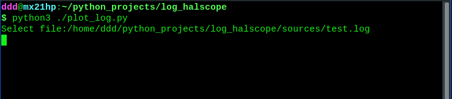
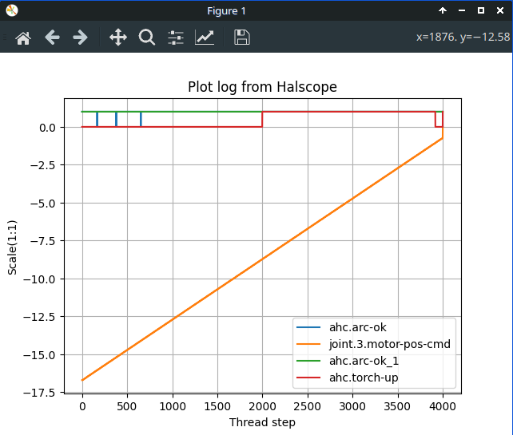

examples are stored in the sources folder *.log

HOWTO:

1. copy to a convenient location.
2. run the program:
    python3 ./plot_log.py
3. specify log file:
    Select file:/way/to/file/file.log

4. analyze graphical log

